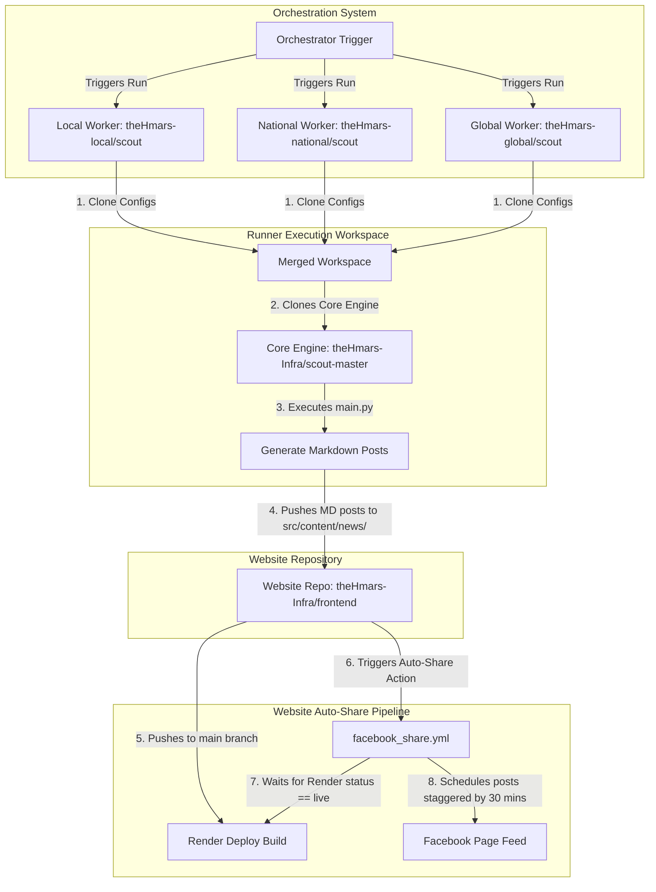

# thehmars (Experimental News Portal)

This is the codebase for **thehmars** (formerly BatchNode), a high-density, general-purpose news portal covering global, national, and regional reports with a professional editorial aesthetic.

## Portal Focus: High-Density News Delivery
The portal delivers a professional newsroom experience using a dark, minimal, and high-urgency visual language. 

### Core Layout Features:
- **Branding**: Simplified to pure typography (**thehmars**).
- **Color Palette**: Vibrant Red Accent theme for high urgency and editorial clarity.
- **Dual-Header Navigation**:
    - **Primary (Fixed)**: Anchored at the top for geographic scopes (Intl/Natl/Local) and utilities.
    - **Secondary (Pill)**: A non-sticky red topical bar for major verticals (Politics, Tech, Sports, etc.) that scrolls away with content.
- **AI Disclaimer**: Rendered as a premium sidebar widget on article pages.
- **AI REPORT Pill**: Displayed on the bottom-right edge of hero images for agent-generated articles.
- **Dynamic Routing**: Categories and region-specific hubs redirect cleanly. "N/A" regions (common for International/National slots) map gracefully to their parent category pages instead of returning 404.

## Repository Structure
- `.github/workflows/`:
  - `facebook_share.yml`: Pushed article triggers that schedule posts to Facebook Page staggered in 30m gaps.
- `public/`:
  - `assets/fallback.webp`: The default curated fallback image used by the pipeline when articles have no featured image.
- `scripts/`:
  - `facebook_publisher.py`: Automated publisher script. Calls Render API to wait for deploy changes to go "live" before queueing posts.
  - `check_fb_queue.py`: Helper script to check currently scheduled posts on Facebook.
  - `clear_fb_queue.py`: Helper script to delete all scheduled posts in the Facebook queue.
- `src/`:
  - `components/`: Modular UI units (Headers, Footers, cards, sharing utilities).
  - `content/`: Blog markdown posts and changelogs.
  - `layouts/`: Master Astro layouts.
  - `pages/`: Dynamic static routing index templates.

## Project Stack
- **Framework**: Astro 5 (Static Output config)
- **Styling**: Tailwind CSS 4 (Red Accent Theme)
- **Data Validation**: Zod (content collection schemas defined in `src/content.config.ts`)

---

## Decoupled News Automation Pipeline Architecture

The news portal operates under a decoupled organizational repository model. This architecture isolates the frontend layout/design and content rendering from the autonomous news gathering pipeline configuration and execution core.

### Repository Ecosystem
1. **Website Repository (This Repo)**: [theHmars-Infra/frontend](https://github.com/theHmars-Infra/frontend)
   - Contains the Astro frontend components, page routes, layouts, and rendering styles.
   - Hosts the compiled news articles in `src/content/news/` as static Markdown files.
   - Houses the GitHub Action workflow for automatic Facebook sharing (`.github/workflows/facebook_share.yml`).
2. **Core Pipeline Engine**: [theHmars-Infra/scout-master](https://github.com/theHmars-Infra/scout-master)
   - Houses the shared orchestration engine, worker logic, and data cleanup algorithms (`downloader.py`, `main.py`, agent templates, etc.).
   - This repository has no configuration context itself, acting purely as a runner engine.
3. **Sourcing Configurations (Worker Scopes)**:
   - Config repos store RSS feed URLs (`sources.json`), scraper history logs, topic filters, custom prompt overrides, and specialized local html cleaner scripts.
   - **Local Worker Config**: [theHmars-local/scout](https://github.com/theHmars-local/scout)
   - **National Worker Config**: [theHmars-national/scout](https://github.com/theHmars-national/scout)
   - **Global Worker Config**: [theHmars-global/scout](https://github.com/theHmars-global/scout)

### Pipeline Execution Schedule
The orchestrator chain runs 3 times a day via a scheduled cron workflow in the `theHmars-Infra/scout-master` repository (defined in `.github/workflows/orchestrator.yml`):
*   **Cron Expression**: `23 0,8,16 * * *` (UTC)
*   **Daily Executions**:
    *   **05:53 IST** (00:23 UTC)
    *   **13:53 IST** (08:23 UTC)
    *   **21:53 IST** (16:23 UTC)
*   **Execution Sequence**: The orchestrator triggers the **Local** scope worker first. Once complete, it invokes the **National** worker, which cascades into the **Global** worker to complete the update cycle.

### Decoupled Pipeline Execution Flow
The following flowchart illustrates how the independent repositories are dynamically combined during an execution run to generate posts and publish them to the website and social feeds:

---

## 📲 Facebook Automated Auto-Share Pipeline

When new markdown articles are pushed to `src/content/news/` by the pipeline runner, a dedicated GitHub Action (`facebook_share.yml`) executes the automated sharing workflow.

For details on workflow configuration secrets, local helper scripts, and detailed publishing logic, please refer to: **[docs/facebook_share.md](docs/facebook_share.md)**.

## Developer & Agent Guidelines
See `AGENTS.md` for specific instructions on maintaining visual elements and contributing to the content layer schema.
